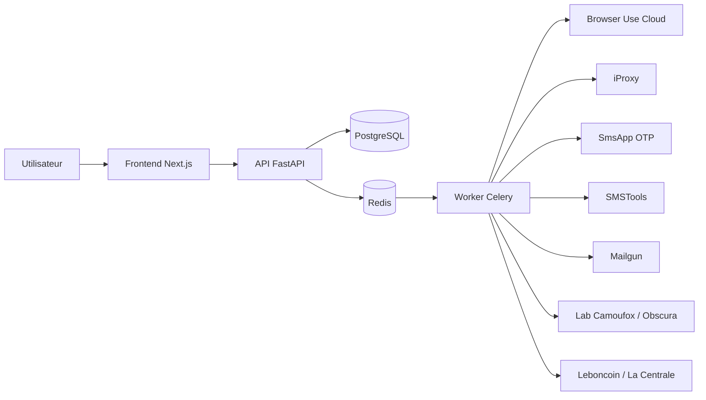

# Guide complet d'utilisation AutoTransfert P2

Ce guide couvre l'installation, la configuration, l'utilisation du dashboard, les workflows, les campagnes, les comptes LBC, Browser Use, les connecteurs, le laboratoire experimental, les incidents et la maintenance.

> Etat au 12 juillet 2026 : le dashboard et les workflows sont operationnels, mais la creation automatique de comptes et le backfill complet des annonces comportent encore les limites decrites dans la section « Limites connues ».

## 1. Objectif du systeme

AutoTransfert P2 automatise la prospection de vendeurs de vehicules :

1. collecter des annonces Leboncoin et La Centrale ;
2. enrichir et analyser les vehicules ;
3. selectionner des annonces selon une campagne ;
4. contacter les vendeurs par messagerie LBC ou SMS ;
5. suivre les reponses et extraire les numeros de telephone ;
6. piloter les comptes, connecteurs, couts et erreurs depuis le dashboard.

Le systeme traite les annonces en base par lots. Une annonce ancienne est eligible au meme titre qu'une nouvelle tant qu'elle correspond aux criteres et n'a pas deja ete contactee.

## 2. Architecture



| Composant | Responsabilite |
|---|---|
| Frontend | Authentification operateur, dashboard et commandes |
| API | Validation, autorisation Control Tower, lectures et creation de workflows |
| Worker | Taches longues, lots, retries et appels fournisseurs |
| PostgreSQL | Annonces, comptes, campagnes, messages, workflows et audits |
| Redis | File Celery et codes temporaires de verification |
| Lab | Diagnostics isoles Camoufox/Obscura, jamais requis pour la production |

## 3. Roles et acces

| Role | Capacites |
|---|---|
| `viewer` | Consultation des dashboards et historiques |
| `operator` | Commandes courantes, campagnes et diagnostics autorises |
| `admin` | Creation de comptes, prompts Browser Use personnalises et laboratoire |

Connexion : ouvrir `https://app.ecovente.com/login`, utiliser l'identifiant fourni par l'administrateur, puis acceder au dashboard.

La session est stockee dans un cookie HttpOnly signe. Ne jamais communiquer `CONTROL_TOWER_TOKEN` a un utilisateur final.

## 4. Navigation du dashboard

### Tableau de bord

Le tableau de bord presente :

- annonces collectees ;
- SMS et messages LBC envoyes/recus ;
- numeros extraits ;
- comptes actifs et en chauffe ;
- campagnes en cours ;
- etat des connecteurs ;
- credits fournisseurs ;
- actions requises ;
- workflows recents et erreurs.

Les workflows sont actualises automatiquement. Une ligne `PENDING` sans `celery_task_id` pendant plusieurs minutes indique un probleme de dispatch. Une ligne `RUNNING` sans nouvelle date d'activite indique un worker ou fournisseur bloque.

### Workflows

Chaque execution contient :

- type et cible ;
- statut ;
- progression et numero de lot ;
- checkpoint ;
- derniere erreur ;
- date de derniere activite ;
- actions pause, reprise, annulation ou retry selon l'etat.

Cycle normal :

```text
PENDING -> RUNNING -> COMPLETED
                    -> FAILED -> RETRY
          -> PAUSED -> RUNNING
          -> CANCELLED
```

Ne relancer un workflow `FAILED` qu'apres correction de sa cause. L'idempotence protege contre plusieurs doublons, mais ne remplace pas cette verification.

### Annonces

Cette page liste les annonces unifiees LBC/La Centrale et leurs informations : titre, prix, kilometrage, localisation, marque, modele, statut et date de collecte.

Une campagne LBC traite uniquement les annonces `LBC`. Une campagne SMS necessite un numero exploitable et respecte la blacklist.

### Campagnes

Pour creer une campagne automobile :

1. choisir marque/modele ;
2. renseigner eventuellement le type de vehicule ;
3. choisir region ou departement ;
4. definir budget minimum et maximum ;
5. rediger le message ;
6. choisir le canal ;
7. fixer le quota ;
8. creer puis demarrer la campagne.

La messagerie LBC traite les annonces eligibles par lots de 25. Elle exclut les annonces deja envoyees/queuees et celles deja traitees par SMS.

Statuts :

- `PENDING` : creee, non demarree ;
- `RUNNING` : un lot est en traitement ;
- `PAUSED` : intervention ou quota requis ;
- `COMPLETED` : backlog en base termine ;
- `FAILED` : erreur technique ;
- `CANCELLED` : arretee par l'operateur.

> `COMPLETED` signifie que toutes les annonces eligibles deja en base ont ete traitees. Cela ne garantit pas que toutes les pages du site source ont ete importees.

### Messagerie LBC

La page affiche les messages sortants et entrants, leur statut, le compte utilise, la date et l'indication d'un numero extrait.

La synchronisation inbox utilise les profils Browser Use actifs. Les numeros trouves sont normalises au format E.164, par exemple `+33612345678`.

### Comptes LBC

Deux modes sont exposes :

| Mode | Methode | Prerequis |
|---|---|---|
| A | Patchright + proxy mobile 4G | iProxy complet, SmsApp, Mailgun, navigateur installe |
| B | Browser Use Cloud | Browser Use, SmsApp, Mailgun |

Etats d'un compte : `EN_CREATION`, `EN_CHAUFFE`, `ACTIF`, `RALENTI`, `BLOQUE`, `QUARANTAINE`.

Procedure cible :

1. cliquer « Creer un compte » ;
2. suivre `account.create` dans Workflows ;
3. attendre les validations OTP ;
4. verifier la session ;
5. chauffer le compte ;
6. executer « Inspecter » ;
7. n'activer le compte qu'apres diagnostic reussi.

Erreurs courantes :

- `IPROXY_CONNECTION_ID is required` : configuration iProxy incomplete ;
- `SMSApp 502 Bad Gateway` : fournisseur OTP indisponible ;
- `No active Browser Use profile` : aucun compte ne possede de profil utilisable par la messagerie ;
- timeout email : webhook Mailgun ou association du compte incomplet.

### Analyse prix

L'analyse compare le vehicule aux annonces presentes en base et peut demander une synthese IA. Les resultats contiennent score prix, moyenne marche, niveau de confiance, fiabilite et conseils.

Un echantillon faible doit etre considere comme indicatif. Ne pas prendre une decision d'achat sur le seul score automatique.

### Connecteurs

| Connecteur | Usage | Verification |
|---|---|---|
| PostgreSQL | Donnees persistantes | Requete `SELECT 1` |
| Redis | File et donnees temporaires | `PING` |
| Celery | Execution asynchrone | Connexion broker |
| Browser Use | Navigation cloud | Lecture d'une tache |
| iProxy | IP mobile FR | Lecture du proxy configure |
| SMSTools | SMS et appels | Liste des SIM actives |
| SmsApp | Achat d'OTP | Pas de probe sans effet ; test lors d'un achat |
| Mailgun | Email catch-all | Etat du domaine |
| Sentry | Erreurs | Transport configure |

`configured` ne veut pas dire `operational`. Toujours verifier le dernier probe et son horodatage.

### Browser Use

Templates disponibles :

- diagnostic d'annonce ;
- enrichissement d'annonce ;
- assistance messagerie sans envoi ;
- diagnostic de compte.

Chaque tache est limitee au domaine autorise, au temps maximal et au plafond de cout. Le resultat, les etapes, captures et cout sont conserves dans le checkpoint du workflow.

Browser Use est adapte aux actions chirurgicales et diagnostics. Il ne doit pas remplacer le scraper par lots pour une collecte massive.

### Laboratoire

Le laboratoire compare Camoufox et Obscura sans partager les profils de production. Il est reserve aux administrateurs et desactive par defaut.

Utilisation :

1. activer explicitement le moteur dans Coolify ;
2. verifier `LAB_API_TOKEN` et les domaines autorises ;
3. lancer un diagnostic sur une URL autorisee ;
4. comparer statut HTTP, classification DataDome, cookies et rapport ;
5. desactiver le moteur apres le test si inutile.

Ne jamais copier un cookie, OTP ou identifiant de session dans un rapport du laboratoire.

## 5. Configuration

### Variables communes API et worker

```dotenv
ENV=production
DATABASE_URL=postgresql+asyncpg://...
REDIS_URL=redis://...
CELERY_BROKER_URL=redis://...
CELERY_RESULT_BACKEND=redis://...
SECRET_KEY=...
CONTROL_TOWER_TOKEN=...
```

### Frontend uniquement

```dotenv
NEXT_PUBLIC_API_URL=https://api.ecovente.com
CONTROL_TOWER_TOKEN=...
CONTROL_TOWER_SESSION_SECRET=...
CONTROL_TOWER_ADMIN_USER=admin
CONTROL_TOWER_ADMIN_PASSWORD=...
```

### Fournisseurs

```dotenv
BROWSER_USE_API_KEY=...
IPROXY_API_KEY=...
IPROXY_CONNECTION_ID=...
IPROXY_PROXY_ID=...
SMSAPP_API_TOKEN=...
SMSTOOLS_API_KEY=...
SMSTOOLS_WEBHOOK_SECRET=...
MAILGUN_API_KEY=...
MAILGUN_DOMAIN=...
MAILGUN_WEBHOOK_SIGNING_KEY=...
OPERATIONAL_DOMAIN=...
SENTRY_DSN=...
```

Ne jamais versionner ces valeurs. Utiliser les secrets Coolify ou un coffre-fort, puis revoquer tout token temporaire transmis pendant une intervention.

## 6. Installation locale

Prerequis : Python 3.12 ou 3.13, Node.js 22, Docker et Git.

```powershell
docker compose up -d postgres postgres_test redis
python -m pip install -e ".[dev]"
Copy-Item .env.example .env
alembic upgrade head
python -m uvicorn app.main:app --reload
```

Dans un deuxieme terminal :

```powershell
celery -A app.tasks worker --loglevel=info --concurrency=2
```

Frontend :

```powershell
Set-Location front
npm install
npm run dev
```

Laboratoire facultatif :

```powershell
docker compose --profile lab up --build experimental_lab
```

## 7. Tests et verification

Backend :

```powershell
python -m pytest -q
python -m ruff check app tests
```

Frontend :

```powershell
Set-Location front
npm test -- --run
npm run lint
npm run build
npm audit --omit=dev
```

Verification minimale apres deploiement :

1. `/health` retourne DB et Redis disponibles ;
2. le worker affiche `ready` et la liste des taches ;
3. le frontend affiche la page de connexion ;
4. un diagnostic Browser Use sans mutation atteint `COMPLETED` ;
5. les connecteurs affichent un controle recent ;
6. aucun workflow ne reste sans activite ni erreur.

## 8. Deploiement Coolify

Ordre recommande, une instance a la fois :

1. pousser le commit GitHub ;
2. deployer l'API ;
3. verifier `/health` et les migrations ;
4. deployer le worker ;
5. verifier `celery ready` ;
6. deployer le frontend ;
7. deployer le laboratoire uniquement si modifie ;
8. effectuer un test de lecture puis un test metier controle.

PostgreSQL et Redis ne sont pas redeployes pour une livraison applicative. Une migration Alembic met a jour le schema sans recreer la base.

## 9. Incidents et reprise

| Symptome | Cause probable | Action |
|---|---|---|
| Workflow `PENDING`, sans task ID | Dispatch Celery/Redis echoue | Verifier Redis, corriger, puis retry |
| Workflow `RUNNING` ancien | Worker bloque ou exception non terminale | Lire logs, stopper, corriger et relancer |
| Campagne `PAUSED` | Quota ou profil manquant | Corriger le compte puis reprendre |
| `No active Browser Use profile` | Aucun profil actif | Creer/importer et diagnostiquer un profil |
| iProxy desactive | IDs ou cle manquants | Completer les trois variables iProxy |
| SmsApp 502 | Fournisseur indisponible | Attendre, verifier le statut et retenter une fois |
| Browser Use 401/403 | Cle invalide ou droits | Remplacer la cle et redemarrer API/worker |
| DataDome/CAPTCHA | Session/IP degradee | Quarantaine, rotation sticky et diagnostic manuel |
| Aucun resultat campagne | Filtres trop stricts ou base vide | Verifier annonces et criteres |

Ne jamais multiplier les retries sur une erreur 401/403 ou une configuration absente. Cela augmente le bruit sans changer le resultat.

## 10. Maintenance longue duree

Chaque jour :

- verifier les workflows `FAILED` et sans heartbeat ;
- verifier les comptes actifs, quotas et campagnes ;
- surveiller les soldes et connecteurs.

Chaque semaine :

- tester un parcours de diagnostic sans mutation ;
- verifier les webhooks et la blacklist ;
- controler la croissance des tables de logs.

Chaque mois :

- rotation des secrets selon politique ;
- revue des couts Browser Use/Anthropic/SMS ;
- sauvegarde restauree sur un environnement de test ;
- mise a jour dependances apres tests ;
- revue des changements de pages LBC/La Centrale.

Avant chaque livraison :

- tests backend/frontend ;
- audit de dependances ;
- migration testee ;
- deploiement sequentiel ;
- verification fonctionnelle ;
- journal de changement.

## 11. Limites connues

- Les routes FastAPI historiques et les webhooks doivent encore etre durcis avant exposition publique complete.
- La creation de compte ne persiste pas encore un profil Browser Use directement exploitable par la messagerie.
- Le flux email de creation doit creer l'enregistrement compte avant d'attendre le webhook.
- Le scraper ne garantit pas encore un backfill pagine complet de toutes les annonces.
- La creation automatisee de compte La Centrale n'est pas implementee ; seul le scraping La Centrale existe.
- Certains workflows hors campagnes/comptes doivent encore recevoir un wrapper d'erreur uniforme.

Voir [REVUE_COMPLETE_2026-07-12.md](./REVUE_COMPLETE_2026-07-12.md) pour les priorites de correction.

## 12. Utilisation de HTML Anything

La version HTML du guide suit le template `docs-page` de [nexu-io/html-anything](https://github.com/nexu-io/html-anything) : navigation laterale, article central, table des matieres, recherche locale, blocs de code et callouts.

Le projet HTML Anything n'est pas ajoute aux dependances de production. Pour regenerer ou personnaliser visuellement le guide :

```powershell
git clone https://github.com/nexu-io/html-anything C:\tmp\html-anything
Set-Location C:\tmp\html-anything
pnpm install
pnpm -F @html-anything/next dev
```

Ouvrir `http://localhost:3000`, choisir `docs-page`, coller ce fichier Markdown et exporter le HTML. La version versionnee est `docs/GUIDE_COMPLET_UTILISATION.html`.

## 13. Apify : comptes, Actors et automatisation SMS

La page `/apify` centralise les comptes Apify, les Actors/Tasks, les runs, les
resultats normalises, les profils d'apprentissage et les exceptions. Un numero
valide entre automatiquement dans la sequence SMS de la campagne liee. Il n'y a
pas de bouton manuel par lead. La deduplication contact/campagne, la blacklist
STOP, les quotas SIM et la fenetre 08:00-20:00 Europe/Paris restent obligatoires.

Ordre de mise en service :

1. connecter le compte et synchroniser le catalogue sans activer de binding ;
2. importer un historique avec les sequences desactivees ;
3. evaluer le profil candidat en mode fantome ;
4. activer un seul Actor sur une campagne de test et un quota SIM reduit ;
5. verifier doublons, STOP, horaires, exceptions et destinataires ;
6. etendre progressivement, puis autoriser les evaluations automatiques.

Une ambiguite de telephone cree une exception et ne demarre aucune sequence. Une
derive superieure aux seuils suspend uniquement le binding concerne. Les profils
peuvent etre restaures par un administrateur depuis l'onglet Apprentissage.

Le dispatcher de secteurs tourne toutes les cinq minutes et selectionne seulement
les secteurs dus. La mention historique d'un scraping global quotidien a 06:00
est obsolete.
